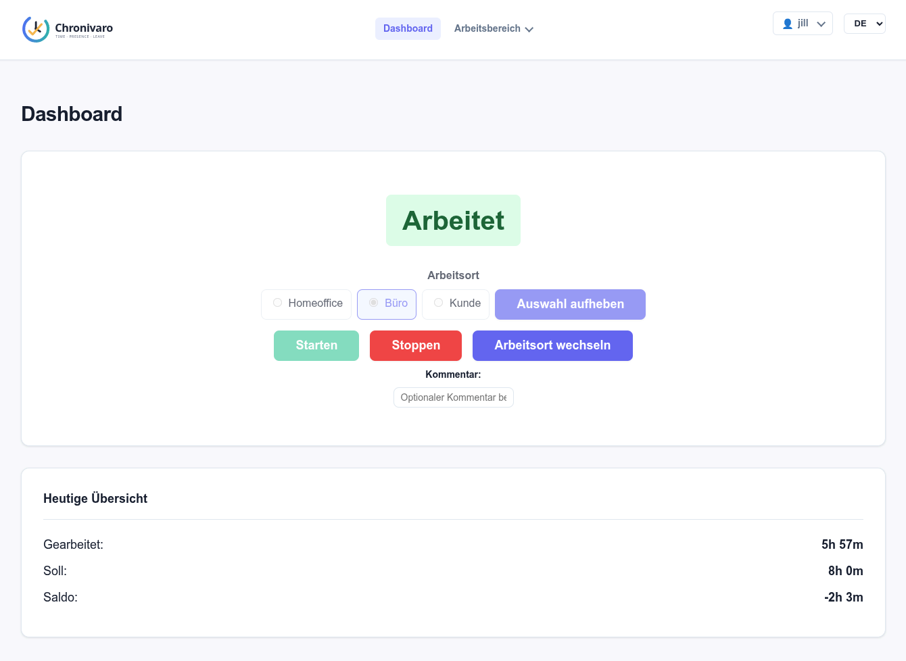
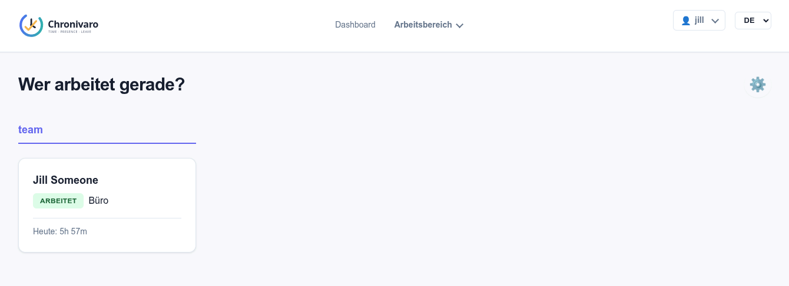
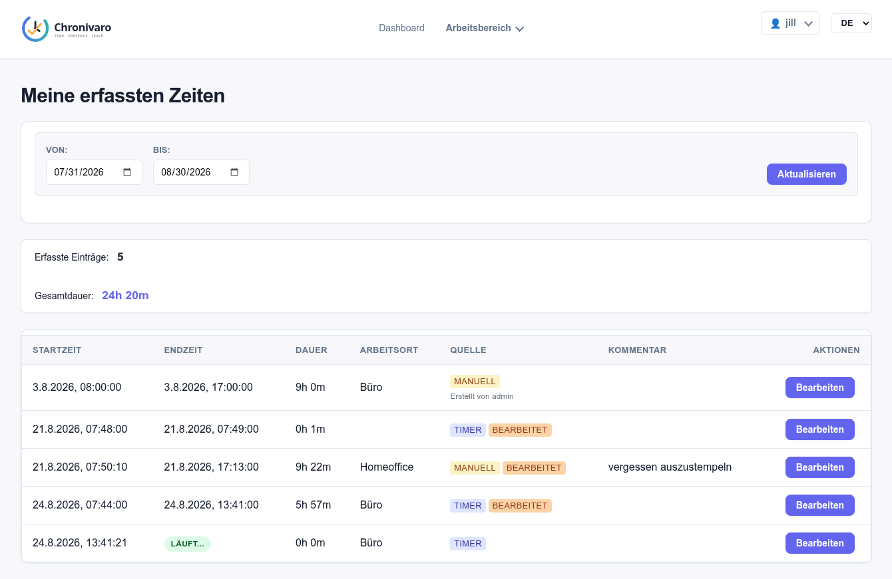
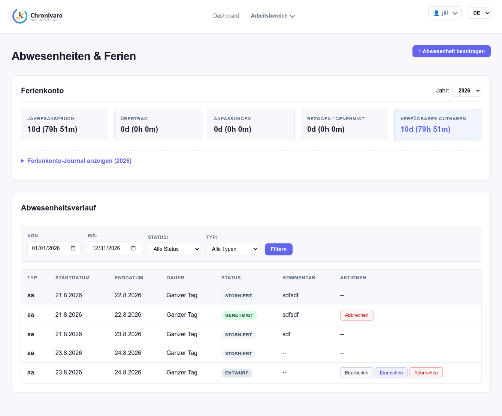
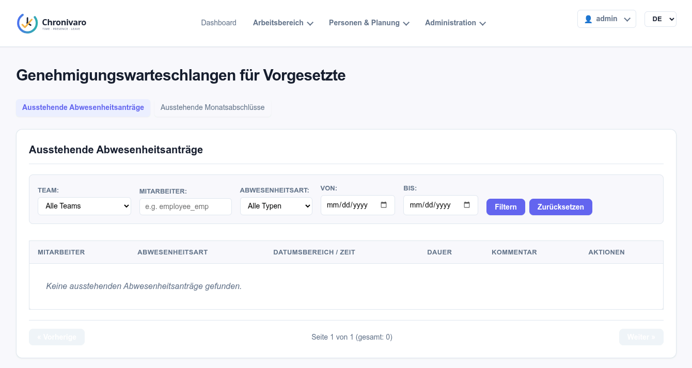
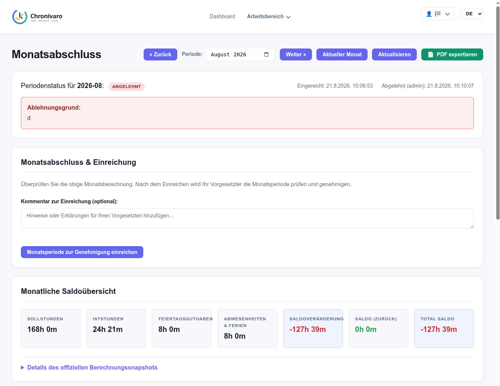
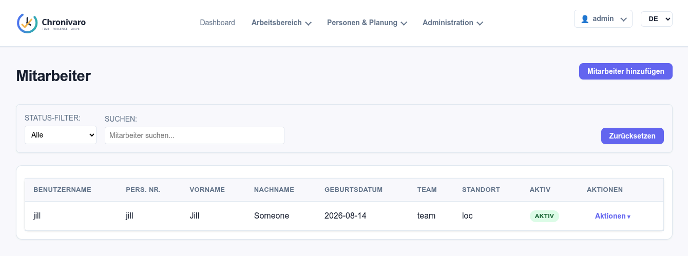
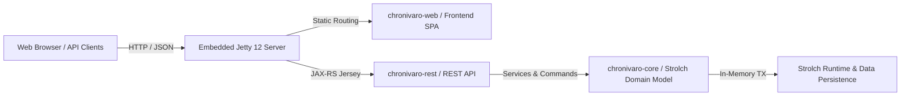

<p align="center">
  <picture>
    <source media="(prefers-color-scheme: dark)" srcset="chronivaro-web/src/main/webapp/assets/icons/chronivaro-logo-dark.svg">
    <source media="(prefers-color-scheme: light)" srcset="chronivaro-web/src/main/webapp/assets/icons/chronivaro-logo-light.svg">
    
  </picture>
</p>

<p align="center">
  <strong>Modern Resource-Order-Activity Working Time, Absence Management, and Period Closing System</strong>
</p>

<p align="center">
  <a href="#-key-features">Features</a> •
  <a href="#-user-interface--screenshots">Screenshots</a> •
  <a href="#-architecture--module-structure">Architecture</a> •
  <a href="#-quick-start--installation">Quick Start</a> •
  <a href="#-running-with-docker">Docker</a> •
  <a href="#-email-delivery--user-challenge-configuration-mailhandler">Mail Config</a> •
  <a href="docs/OPERATIONS.md">Operations</a> •
  <a href="docs/openapi.yaml">REST API</a> •
  <a href="LICENSE">License</a>
</p>

<p align="center">
  
  
  
  
  
  
</p>

---

## 📖 Overview

**Chronivaro** is a lightweight, high-performance working time and absence management platform built on the [Strolch](https://strolch.li) framework. It delivers precise multi-block daily time tracking with automatic break derivation, comprehensive vacation journal accounting, monthly period closing workflows with calculation snapshots, role-based supervisor approval queues, and tenant-wide administration.

The system is packaged as a standalone fat-JAR with an embedded Eclipse Jetty 12 runtime, serving both modern Web Component frontend assets and REST API endpoints without requiring an external servlet container.

---

## 📸 User Interface & Screenshots

Chronivaro offers a responsive single-page web interface tailored for employees, supervisors, HR managers, and administrators.

<p align="center">
  
</p>

<details>
<summary><strong>🔍 Click to preview key interface highlights</strong></summary>

<br>

| Live Team Presence ("Who is Working?") | Multi-Block Daily Time Recording |
|:---:|:---:|
|  |  |

| Absence Requests & Vacation Balances | Supervisor Approvals Inbox |
|:---:|:---:|
|  |  |

| Monthly Period Closing & Calculation Snapshot | Master Data & Employee Administration |
|:---:|:---:|
|  |  |

</details>

> 📚 **Explore the complete visual walkthrough**: See the **[Full UI Screenshots Gallery](docs/SCREENSHOTS.md)** for all 21 application screens, including reporting views, work schedule definitions, holiday calendars, and audit logs.

---

## ✨ Key Features

- ⏱️ **Time Tracking & Live Timer**: Real-time start/stop timer, manual work entry creation/editing, multi-interval daily tracking, automatic break calculation from time gaps, and overnight shift handling.
- 🌴 **Absence & Vacation Management**: Multi-type absence requests (Vacation, Sickness, Military/Civil Defense, Special Leave) with flexible units (Full-Day, Half-Day, Hours), quota accounting, and balance progression.
- ✅ **Supervisor Approval Queues**: Dedicated approval inbox for team supervisors and HR managers with optimistic concurrency validation, team/type filters, and mandatory rejection feedback.
- 📅 **Monthly Period Closing Workflow**: Employee period submission, calculation snapshot generation (actual vs. target hours, overtime/undertime), supervisor approval, and HR/Admin period locking.
- 📊 **Reporting & RFC 4180 CSV Export**: Personal summaries, monthly balance histories, vacation account journals, team performance overviews, and filtered absence reports with UTF-8 BOM encoding for Excel.
- 👥 **Tenant Administration & Self-Service**: Comprehensive master data management for employees, employment schedules, teams, locations, holiday calendars, absence types, global tenant parameters, and user self-service password management.
- 🔒 **Security & Audit Logging**: Role-based access control (Employee, Supervisor, HR, Administrator), immutable append-only audit trail logging all state transitions, approvals, and configuration changes.
- 🚀 **Standalone Embedded Jetty Execution**: Single self-contained fat-JAR (`chronivaro.jar`) delivering frontend assets and REST API endpoints out-of-the-box.

---

## 🏗️ Architecture & Module Structure

Chronivaro is structured as a modular Maven project separating core domain logic, REST APIs, frontend web components, and standalone packaging:



### Module Breakdown

| Module | Description |
|---|---|
| `chronivaro-core` | Domain model, Strolch services, commands, searches, and calculation policies |
| `chronivaro-rest` | Jakarta REST (Jersey) endpoints, DTO mappers, authentication filters, and error mappers |
| `chronivaro-web` | Single Page Application (Web Components, JavaScript modules, CSS, icons) |
| `chronivaro-app` | Standalone launcher with embedded Eclipse Jetty HTTP server and fat-JAR packaging |
| `docs/` | Architecture specifications, REST API OpenAPI definition, screenshots gallery, and operations guides |
| `runtime/` | Strolch runtime directory (configuration XMLs, templates, and model persistence) |

---

## ⚡ Quick Start & Installation

### Prerequisites

- **Java Runtime**: JDK 25 (or JDK 24+)
- **Build Tool**: Maven 3.6+
- **Browser**: Modern web browser (Firefox, Chrome, Edge, Safari)

### Build from Source

To build all modules and package the executable fat-JAR:

```bash
mvn clean install
```

To run unit and integration tests:

```bash
mvn test
```

The resulting executable fat-JAR is located at:
```text
chronivaro-app/target/chronivaro.jar
```

---

## 🚀 Running Chronivaro

Start Chronivaro as a standalone application using Java:

```bash
java -jar chronivaro-app/target/chronivaro.jar --port 8080 --runtime ./runtime --env dev
```

The application will be accessible at `http://localhost:8080`.

### CLI Arguments & Environment Variables

| Argument | Environment Variable | Default Value | Description |
|---|---|---|---|
| `--port <int>` | `PORT` / `CHRONIVARO_PORT` | `8080` | HTTP port to listen on (`0` binds to dynamic available port) |
| `--bind <address>` | `BIND_ADDRESS` / `CHRONIVARO_BIND` | `0.0.0.0` | IP address to bind HTTP listener |
| `--context-path <path>` | `CONTEXT_PATH` | `/` | Base HTTP context path for Web UI and REST endpoints |
| `--no-http` | `NO_HTTP` | `false` | Disable HTTP server and run Strolch core runtime only |
| `--runtime <path>` | `STROLCH_PATH` | `./runtime` | Path to Strolch runtime directory containing `config/` and `data/` |
| `--env <name>` | `STROLCH_ENV` / `STROLCH_ENVIRONMENT` | `dev` | Environment configuration profile (e.g. `dev`, `prod`, `test`) |
| `--web-resources <path>`| `WEB_RESOURCES_PATH` | `null` (auto) | Custom filesystem path to override static frontend assets |

---

## 🐳 Running with Docker

### Development (Local Build)

1. Build the project from the root:
   ```bash
   mvn clean package -DskipTests
   ```
2. Start the container stack using Docker Compose:
   ```bash
   docker compose -f docker-compose-dev.yml up --build
   ```
3. Open `http://localhost:8080` in your browser.

### Building & Pushing Docker Images

Build and tag the local Docker image:
```bash
./build-docker-image.sh
```

Build, tag, and push to the remote registry (`repo.strolch.li`):
```bash
./build-and-push-docker.sh
```

### Packaging Runtime Distribution Archive (`runtime.tar.gz`)

To package a clean, ready-to-use runtime environment tarball for deployment:

```bash
# Using the shell script
./build-runtime-tarball.sh -o runtime.tar.gz

# Or using the Java class directly
java -cp "chronivaro-app/target/*" ch.eitchnet.chronivaro.app.RuntimeArchiveGenerator -s runtime -o runtime.tar.gz
```

The packaging process automatically:
- Copies all necessary configuration and model files from `runtime/`.
- Excludes temporary/session files (`runtime/temp/`) and dbStore directories (`runtime/data/dbStore/`).
- Sanitizes `PrivilegeUsers.xml` to remove personal user accounts while preserving system accounts (`State=SYSTEM`) and the `admin` user.

### Production Deployment with Docker Compose

1. Prepare directory structure on host:
   ```bash
   mkdir chronivaro && cd chronivaro
   mkdir -p runtime/{config,data,temp}
   ```
2. Copy configuration files from `runtime/` into `runtime/` (`config/`, `data/`, `temp/`).
3. Set secure values for `secretKey` and `secretSalt` in `runtime/config/PrivilegeConfig.xml`.
4. Configure mail delivery in `runtime/config/StrolchConfiguration.xml` (see [Email Delivery & MailHandler Configuration](#-email-delivery--user-challenge-configuration-mailhandler) below).
5. Copy `docker-compose.yml` to the directory.
6. Launch the container:
   ```bash
   docker compose up -d
   docker compose logs -f
   ```

---

## ✉️ Email Delivery & User Challenge Configuration (MailHandler)

Chronivaro uses Strolch's `li.strolch.privilege.handler.MailUserChallengeHandler` in `runtime/config/PrivilegeConfig.xml` to deliver user registration challenges and password reset tokens.

Challenge delivery is handled by the `MailHandler` component configured in `runtime/config/StrolchConfiguration.xml`:

- **Development (`SimulatedMailHandler`)**: By default in local/dev environments, `SimulatedMailHandler` intercepts outgoing emails and logs challenge links to the standard log output, allowing local testing without an SMTP server.
- **Production (`SmtpMailHandler`)**: For production deployments, switch the implementation to `SmtpMailHandler` and configure your SMTP server connection parameters. **No modifications to `PrivilegeConfig.xml` are needed.**

```xml
<Component>
    <name>MailHandler</name>
    <api>li.strolch.handler.mail.MailHandler</api>
    <!-- For production SMTP: -->
    <!-- <impl>li.strolch.handler.mail.SmtpMailHandler</impl> -->
    <!-- For local development / simulation: -->
    <impl>li.strolch.handler.mail.SimulatedMailHandler</impl>
    <Properties>
        <fromAddr>Chronivaro &lt;sender@example.ch&gt;</fromAddr>
        <username>sender@example.ch</username>
        <password>XXX</password>
        <auth>true</auth>
        <startTls>true</startTls>
        <host>smtp.gmail.com</host>
        <port>587</port>
        <sign>false</sign>
        <!-- Optional PGP signing key in runtime/config/ -->
        <signingKey>sender@example.ch.key</signingKey>
        <signingKeyPassword>myKeyPassword</signingKeyPassword>
        <encrypt>false</encrypt>
        <!-- Optional comma-separated list of recipient PGP public keys in runtime/config/ -->
        <recipientPublicKeys>eitch@eitchnet.ch.asc</recipientPublicKeys>
    </Properties>
</Component>
```

See [docs/OPERATIONS.md](docs/OPERATIONS.md) for detailed descriptions of all `MailHandler` configuration properties.

---

## 🔑 Initial Administrator Login & Employee Setup

1. **Initial Login**: Navigate to `http://localhost:8080` and log in with default credentials:
   - **Username**: `admin`
   - **Password**: `admin`
2. **Mandatory Password Change**: Immediately change the default admin password via the user profile dropdown in the top header.
3. **First Employee Onboarding**:
   - Verify/configure Locations, Teams, and Work Schedule Templates under **Administration**.
   - Create the employee profile in **Administration -> Employees**, assigning Team, Location, and Schedule Template. Saving the employee automatically provisions the linked user account.
   - Initiate registration by selecting **Actions -> Register** on the employee row.
   - The employee completes the registration form with their challenge code to set their password, logs in, and can start tracking time immediately.

---

## 🩺 System Probes & Telemetry

Chronivaro provides unauthenticated standard endpoints for container orchestration, load balancers, and health checks:

| Endpoint | Method | Description |
|---|---|---|
| `/rest/chronivaro/v1/system/health` | `GET` | **Liveness Probe**: Returns HTTP 200 `{"status": "UP", "agentState": "RUNNING", "uptimeMs": ...}` |
| `/rest/chronivaro/v1/system/readiness`| `GET` | **Readiness Probe**: Returns HTTP 200 `{"status": "READY", "activeRealms": [...]}` when ready for traffic |
| `/rest/chronivaro/v1/system/version` | `GET` | **Version Metadata**: Returns application version, build timestamp, environment, and Strolch version |
| `/rest/chronivaro/v1/system/metrics` | `GET` | **JVM Telemetry**: Returns heap/non-heap memory, active threads, system load average, and uptime |

---

## 📝 Observability & Structured Logging

Chronivaro uses SLF4J with Logback for structured logging. Every HTTP request carries an `X-Correlation-Id` header mapped to the logging MDC context:

```text
2026-08-19 13:30:00.123 [qtp1234567-24] [corrId=e4a1b2c3-4d5e-6f7a-8b9c-0d1e2f3a4b5c] INFO  ch.eitchnet.chronivaro.rest.resource.ChronivaroResource - Processed presence query
```

Clients can supply custom correlation IDs via the `X-Correlation-Id` request header; otherwise, the server automatically generates and returns a UUID correlation ID in the response headers.

---

## 🛡️ Role-Based Access & Security

| Role | Responsibilities & Capabilities |
|---|---|
| **Employee** | Record work entries, start/stop timers, view team presence ("Who is working?"), view personal balances, submit absence requests, submit monthly closing periods |
| **Supervisor** | View team presence, review and approve/reject team absence requests, review submitted monthly periods for supervised teams with calculation snapshots |
| **HR** | Manage employee profiles, administer vacation entitlements and adjustments, unlock/lock periods across the tenant, view all absence reports |
| **Administrator** | Manage global configuration parameters, holiday calendars, teams, locations, schedule templates, and inspect tenant audit logs |
| **StrolchAdmin** | Full framework administration and privilege user/role management |

---

## 📚 Documentation

- 🖼️ **[Screenshots Gallery](docs/SCREENSHOTS.md)**: Comprehensive visual tour of all application views and administration screens.
- ⚙️ **[Operations & Deployment Guide](docs/OPERATIONS.md)**: Production deployment, container setup, systemd integration, and disaster recovery.
- 📡 **[OpenAPI Specification](docs/openapi.yaml)**: Comprehensive REST API contract with request/response schemas and examples.
- 📋 **[Implementation Backlog](docs/IMPLEMENTATION_BACKLOG.md)**: Granular task breakdown and implementation history.
- 📊 **[Implementation Status](docs/IMPLEMENTATION_STATUS.md)**: Architectural decisions, delivered milestones, and verification summary.

---

## 📄 License

Chronivaro is free software licensed under the [GNU Affero General Public License v3.0](LICENSE) (AGPL-3.0).
