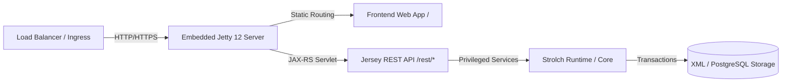

# Chronivaro Operations and Production Guide

This guide describes operational requirements, deployment procedures, system health monitoring, logging, performance expectations, data privacy, and disaster recovery for Chronivaro.

---

## 1. Production Architecture

Chronivaro is packaged as an executable standalone application (`chronivaro.jar`) combining the Strolch in-memory transaction runtime and embedded Eclipse Jetty 12 (EE10) HTTP servlet container.



- **Unified Port Architecture**: Both static frontend web assets (`/`, `/index.html`, `/assets/*`, `/js/*`) and JAX-RS REST endpoints (`/rest/chronivaro/v1/*`) are served on a single HTTP connector port.
- **Strict Layering**: `chronivaro-core` and `chronivaro-rest` maintain zero dependencies on Jetty or servlet container internals.

---

## 2. Deployment Procedures

### 2.1 Standalone Systemd Service Unit

Deploy Chronivaro on Linux using a standard systemd service unit (`/etc/systemd/system/chronivaro.service`):

```ini
[Unit]
Description=Chronivaro Time and Absence Tracking Service
After=network.target

[Service]
Type=simple
User=chronivaro
Group=chronivaro
WorkingDirectory=/opt/chronivaro
ExecStart=/usr/bin/java -Xms512m -Xmx2048m -jar /opt/chronivaro/chronivaro.jar --port 8080 --runtime /opt/chronivaro/runtime --env prod
Restart=always
RestartSec=10
SuccessExitStatus=143
TimeoutStopSec=15

[Install]
WantedBy=multi-user.target
```

Commands:
```bash
sudo systemctl daemon-reload
sudo systemctl enable chronivaro
sudo systemctl start chronivaro
sudo systemctl status chronivaro
```

### 2.2 Docker Container Distribution & Deployment

Chronivaro is distributed as a lightweight, non-root Docker container image (`repo.strolch.li/docker/chronivaro:latest`) packaging the standalone application with Eclipse Temurin OpenJDK JRE 25.

#### 2.2.1 Building and Pushing the Docker Image (Maintainers)

To build and tag the Docker image locally:

```bash
# Build the project JAR first
mvn clean package -DskipTests

# Build the local docker image
./build-docker-image.sh
```

To build and push the image to the remote registry (`repo.strolch.li`):

```bash
./build-and-push-docker.sh
```

Or manually using custom options:

```bash
./build-docker-image.sh -p -c -r repo.strolch.li
```

- `-p`: Push to Docker image registry
- `-c`: Clean up local tags after successful push
- `-r <registry>`: Target registry host (default: `repo.strolch.li`)

#### 2.2.2 Pulling the Docker Image

Users and operators can pull the prebuilt image from the registry:

```bash
docker pull repo.strolch.li/docker/chronivaro:latest
```

#### 2.2.3 Strolch Runtime Requirement & Architecture

The Chronivaro Docker image (`repo.strolch.li/docker/chronivaro:latest`) packages only the application binaries and the embedded runtime (`chronivaro.jar`). It does not bundle environment-specific configurations or initial tenant model state.

When Docker launches the container, it mounts `./runtime` from the host to `/chronivaro-runtime` inside the container. If `./runtime` is empty or uninitialized, the Strolch agent cannot locate `StrolchConfiguration.xml` during bootstrapping and the application container will fail immediately on startup.

##### Why Chronivaro Requires an External Runtime:
1. **Separation of Binary and Configuration**: The container image remains generic, immutable, and stateless across all deployments while environment configurations (e.g., logging levels, realm providers, thread pools) are configured per deployment.
2. **Security & Secret Isolation**: Cryptographic parameters (`secretKey` and `secretSalt` in `PrivilegeConfig.xml`) and administrative credentials in `PrivilegeUsers.xml` are not baked into public image layers.
3. **Data Persistence Across Container Restarts**: In file-based persistence mode, Strolch loads and commits domain elements into `runtime/data/Model.xml`. Mounting the runtime directory ensures all work entries, employee profiles, vacation accounts, and session tokens (`runtime/temp/sessions.dat`) persist across container updates and restarts.

##### Required Strolch Runtime Directory Layout:

```text
chronivaro/
├── docker-compose.yml (or compose.yaml)
└── runtime/
    ├── config/
    │   ├── PrivilegeConfig.xml        # Secret key/salt and hashing parameters
    │   ├── PrivilegeRoles.xml         # Role-to-privilege mappings
    │   ├── PrivilegeUsers.xml         # User accounts and credentials
    │   ├── StrolchConfiguration.xml   # Core agent & realm configuration
    │   └── StrolchPolicies.xml        # Policy definitions (break & holiday policies)
    ├── data/
    │   ├── templates.xml              # Resource and Order element schema definitions
    │   └── Model.xml                  # Initial tenant master data and domain entities
    └── temp/                          # Runtime temporary cache and session tokens
```

#### 2.2.4 Step-by-Step Runtime Preparation Guide

Before running `docker compose up -d`, prepare the runtime directory on the host:

1. **Option A: Unpack Prebuilt Runtime Archive (`runtime.tar.gz`)**:
   If you have generated or obtained `runtime.tar.gz`, simply extract it:
   ```bash
   mkdir -p chronivaro && cd chronivaro
   tar -xzvf /path/to/runtime.tar.gz
   ```
   This creates a clean `runtime/` directory containing all configuration and data files with filtered user accounts (`admin` and `SYSTEM` users only).

2. **Option B: Manual Runtime Directory Setup**:
   ```bash
   mkdir -p chronivaro/runtime/{config,data,temp}
   cd chronivaro
   ```
   Copy the seed configuration and data files from the Chronivaro repository (`Chronivaro/runtime/`) into `./runtime/`:
   - Copy `runtime/config/*` to `./runtime/config/`
   - Copy `runtime/data/*` to `./runtime/data/`

3. **Configure Authentication Secrets & User Challenge Handler**:
   Edit `./runtime/config/PrivilegeConfig.xml` to generate and assign unique cryptographic keys:
   ```xml
   <Parameter name="secretKey" value="<GENERATE_RANDOM_SECRET_KEY>"/>
   <Parameter name="secretSalt" value="<GENERATE_RANDOM_SECRET_SALT>"/>
   ```
   By default, Chronivaro is configured to use Strolch's `MailUserChallengeHandler` for delivering user registration challenges and password reset codes:
   ```xml
   <UserChallengeHandler class="li.strolch.privilege.handler.MailUserChallengeHandler"/>
   ```

4. **Configure Mail Delivery (Strolch MailHandler)**:
   Chronivaro's `MailUserChallengeHandler` delegates email dispatching to the `MailHandler` component defined in `runtime/config/StrolchConfiguration.xml`.
   
   - **Development & Testing (`SimulatedMailHandler`)**:
     In the development environment profile (`dev`), Chronivaro uses `SimulatedMailHandler`. Outgoing emails (such as registration and password reset challenge links) are printed directly to the system logs, allowing quick local testing without an external mail server.
   
   - **Production Deployment (`SmtpMailHandler`)**:
     For production environments, configure real SMTP delivery by switching the implementation class to `SmtpMailHandler` and updating the mail server credentials in `runtime/config/StrolchConfiguration.xml`. **No changes are required in `PrivilegeConfig.xml`**.

   ```xml
   <Component>
       <name>MailHandler</name>
       <api>li.strolch.handler.mail.MailHandler</api>
       <!-- For production SMTP: -->
       <!-- <impl>li.strolch.handler.mail.SmtpMailHandler</impl> -->
       <!-- For local development / simulation: -->
       <impl>li.strolch.handler.mail.SimulatedMailHandler</impl>
       <Properties>
           <fromAddr>Chronivaro &lt;sender@example.ch&gt;</fromAddr>
           <username>sender@example.ch</username>
           <password>XXX</password>
           <auth>true</auth>
           <startTls>true</startTls>
           <host>smtp.gmail.com</host>
           <port>587</port>
           <sign>false</sign>
           <!-- Optional PGP signing key (must exist in runtime/config/ if sign=true) -->
           <signingKey>sender@example.ch.key</signingKey>
           <signingKeyPassword>myKeyPassword</signingKeyPassword>
           <encrypt>false</encrypt>
           <!-- Optional comma-separated list of recipient PGP public keys in runtime/config/ if encrypt=true -->
           <recipientPublicKeys>eitch@eitchnet.ch.asc</recipientPublicKeys>
       </Properties>
   </Component>
   ```

   **MailHandler Configuration Parameters**:
   - `fromAddr`: The sender address displayed on outgoing emails (e.g., `Chronivaro <sender@example.ch>`).
   - `username`: The SMTP username / email address used for server authentication.
   - `password`: The SMTP password or application token.
   - `auth`: `true` to authenticate with `username` and `password`; `false` if the SMTP server allows unauthenticated relaying.
   - `startTls`: `true` to enable TLS via STARTTLS (standard on port 587).
   - `host`: The SMTP server hostname or IP (e.g., `smtp.gmail.com`, `mail.company.ch`).
   - `port`: The SMTP server port (typically `587` for STARTTLS or `465` for SMTPS).
   - `sign`: `true` to cryptographically sign outgoing emails using PGP.
   - `signingKey`: The file name of the PGP private key in `runtime/config/` (required if `sign` is `true`).
   - `signingKeyPassword`: The passphrase for the PGP private key.
   - `encrypt`: `true` to encrypt outgoing emails using recipient PGP public keys.
   - `recipientPublicKeys`: Comma-separated list of PGP public key files stored in `runtime/config/`.

5. **Adjust Directory Ownership & Permissions**:
   The Docker container runs as a non-root user (`UID 1000` / `GID 1000` by default). Ensure the runtime directory is readable and writable by this user:
   ```bash
   chmod -R 775 runtime/
   chown -R 1000:1000 runtime/
   ```

#### 2.2.5 Starting Chronivaro with Docker Compose

Place the `docker-compose.yml` (or `compose.yaml`) file in your `chronivaro` directory:

```yaml
services:
  app:
    image: repo.strolch.li/docker/chronivaro:latest
    container_name: chronivaro
    hostname: app
    ports:
      - 127.0.0.1:8080:8080
    user: "${UID:-1000}:${GID:-1000}"
    environment:
      - TZ=Europe/Zurich
      - STROLCH_ENVIRONMENT=dev
      - PORT=8080
    volumes:
      - ./runtime:/chronivaro-runtime
    restart: unless-stopped
```

Start the application daemon:

```bash
docker compose up -d
```

Follow the startup logs:

```bash
docker compose logs -f
```

The application will bootstrap the Strolch agent from `/chronivaro-runtime` and be available at `http://localhost:8080` (or the configured host port).

To stop the container:

```bash
docker compose down
```

To update to a newer image version:

```bash
docker compose pull
docker compose up -d
```

#### 2.2.6 Local Development with Docker Compose

For developers building the image from local source:

```bash
# Build the application JAR
mvn clean package -DskipTests

# Start the local development container
docker compose -f docker-compose-dev.yml up --build
```

---

### 2.3 Release & Publishing Management (GitHub & Mastodon)

Chronivaro provides a centralized release automation script (`release.sh`) in the repository root. It streamlines version tagging, packaging, checksum verification, GitHub Releases publishing, and Mastodon announcements.

#### 2.3.1 Capabilities
- **Artifact Packaging**: Packages the executable standalone fat-JAR (`chronivaro-<version>.jar`) and generates a clean, sanitized runtime distribution tarball (`runtime-<version>.tar.gz`).
- **Checksum Generation**: Automatically generates `SHA256SUMS.txt` for all release binaries.
- **GPG Signing**: Signs all release artifacts (`.jar`, `.tar.gz`, and `SHA256SUMS.txt`) with GPG detached ASCII-armored signatures (`.asc`) using the default (or configured) GPG key.
- **Signed Git Tagging**: Creates GPG-signed and annotated Git tags (`git tag -s -m <version>`) representing the exact release version.
- **Changelog / Release Notes Generation**:
  - For version `0.1.0` (initial MVP release), automatically formats a comprehensive feature breakdown.
  - For subsequent releases, automatically extracts Git commit history since the previous release tag.
  - Supports passing a custom changelog markdown file via `-c / --changelog`.
- **GitHub Release Integration**: Publishes the release and uploads binary assets using GitHub CLI (`gh`) or GitHub REST API (`GITHUB_TOKEN`).
- **Mastodon Announcement Hook**: Automatically posts a formatted release announcement to a configured Mastodon instance.
- **Simulation / Dry-Run Mode**: Allows previewing exact release notes, binary assets, checksums, GitHub API actions, and Mastodon toots without performing real network operations or Git tag creation.

#### 2.3.2 Usage & Commands

```bash
# 1. Preview release in simulation mode (dry-run):
./release.sh --simulate

# 2. Preview simulation with Mastodon announcement hook:
./release.sh --simulate --mastodon --mastodon-instance mastodon.social --mastodon-token $MASTODON_TOKEN

# 3. Perform official release with Maven build:
./release.sh -v 0.1.0 -b

# 4. Perform official release and publish announcement to Mastodon:
./release.sh -v 0.1.0 -b -m
```

#### 2.3.3 Configuration Parameters & Environment Variables

| Variable / Flag | Description | Default |
|---|---|---|
| `-v, --version <version>` | Release version number | Extracted from `pom.xml` |
| `-t, --tag <tag>` | Git tag name | `v<version>` |
| `-s, --simulate` | Dry-run simulation mode | `false` |
| `-b, --build` | Trigger `mvn clean package -DskipTests` | `false` |
| `--gpg-key <key-id>` | GPG key ID/email for signing tags and assets | Default GPG key |
| `-m, --mastodon` | Enable Mastodon announcement | Auto if credentials provided |
| `GITHUB_TOKEN` | GitHub Personal Access Token | Required if `gh` CLI not logged in |
| `GPG_KEY` / `GPG_KEY_ID` | GPG key ID/email for signing tags and assets | Default GPG key |
| `MASTODON_INSTANCE` | Mastodon instance host (e.g., `mastodon.social`) | — |
| `MASTODON_ACCESS_TOKEN` | Mastodon API bearer token | — |
| `MASTODON_VISIBILITY` | Toot visibility (`public`, `unlisted`, `private`) | `public` |

##### Environment Configuration File
The release script automatically loads credentials and environment variables from the file `${HOME}/.config/chronivaro/release.env` if present. No other environment files are loaded.

Example `${HOME}/.config/chronivaro/release.env`:
```bash
# GitHub Release Configuration
GITHUB_TOKEN="ghp_xxxxxxxxxxxxxxxxxxxx"

# Mastodon Announcement Hook Configuration
MASTODON_INSTANCE="mastodon.social"
MASTODON_ACCESS_TOKEN="xxxxxxxxxxxxxxxxxxxx"
MASTODON_VISIBILITY="public"
```

---

## 3. Initial System Access & Tenant Onboarding

After starting Chronivaro for the first time, perform initial administrator setup and prepare the tenant before onboarding employees.

### 3.1 First Administrator Login & Password Security

1. **Access the Web Interface**:
   Open a web browser and navigate to `http://localhost:8080` (or your configured host and port).
2. **Login with Default Administrator Credentials**:
   - **Username**: `admin`
   - **Password**: `admin`
3. **Immediately Change the Administrator Password**:
   - For security, never leave default credentials active in any environment.
   - Click on the user profile dropdown in the header and select **Change Password** (or manage credentials via User Administration).
   - Enter the current password (`admin`) and set a strong, unique administrative password.

### 3.2 Prerequisites Checklist Before First Employee Login

Before a new employee can log in and start tracking time, the administrator or HR manager must ensure foundational master data and the employee profile are configured:

1. **Verify Global Configuration & Absence Types**:
   - Verify global tenant parameters under Administration (e.g., standard weekly target hours, default annual vacation entitlement, and tenant language).
   - Ensure standard absence types (`VACATION`, `ILLNESS`, `ACCIDENT`, `MILITARY_CIVIL_DEFENSE`, etc.) are active.
2. **Configure Locations & Holiday Calendars**:
   - Create or verify company locations (e.g., Zurich HQ).
   - Ensure the associated holiday calendar is configured so public holidays are credited against daily target hours.
3. **Configure Teams**:
   - Create organizational teams (e.g., Engineering, Marketing, Administration).
   - Assign designated supervisors or team leads responsible for approving time entries, period closures, and absence requests.
4. **Define Employment Schedule Templates**:
   - Create or select an employment schedule template (e.g., *Standard Monday–Friday 8h / 40h week*, or part-time models like 80% / 50%).
   - These templates define daily target minutes (Monday through Sunday) and work pensum.
5. **Create the Employee Profile & Link User Account**:
   - Navigate to **Administration -> Employees** and create the employee record.
   - Enter personal details (Firstname, Lastname, Email, Join Date, and desired Username).
   - Assign the employee to their **Primary Team**, **Location**, and **Employment Schedule Template**.
   - Saving the employee automatically creates the linked Strolch user account (with `Employee` and `ModelAccessor` roles, without a pre-set password), initializes their employment schedule version, and calculates their initial pro-rated vacation entitlement for the calendar year.
6. **Initiate Employee Registration**:
   - In **Administration -> Employees**, click on **Actions -> Register** for the newly created employee.
   - This triggers the registration process (`POST /rest/chronivaro/v1/employees/{id}/register`) and issues a registration challenge code for the user account.

### 3.3 Employee Registration Completion & First Login

Once registration is initiated:
1. **Complete Registration**:
   - The employee accesses the registration form (via the registration link or navigation to the complete registration view: `http://localhost:8080/#complete-registration?username=<username>&challenge=<challenge>`).
   - The employee enters their username, challenge code, and sets their personal secure password.
2. **Login & Start Time Tracking**:
   - The employee logs in at `http://localhost:8080` with their username and newly created password.
   - The employee can immediately:
     - Start and stop the real-time timer on the dashboard.
     - Record and edit manual work blocks and break intervals.
     - View live daily and monthly target vs. actual time balances.
     - Submit absence requests (e.g., vacation days) for supervisor approval.

---

## 4. Health Checks & Monitoring

Chronivaro exposes standard unauthenticated system probes:

### 4.1 Liveness Probe (`GET /rest/chronivaro/v1/system/health`)

Verifies that the HTTP server and Strolch agent are active:

```json
{
  "status": "UP",
  "agentState": "RUNNING",
  "uptimeMs": 3600120,
  "timestamp": "2026-08-19T13:30:00.000+02:00"
}
```

### 4.2 Readiness Probe (`GET /rest/chronivaro/v1/system/readiness`)

Verifies that domain realms are loaded and ready to serve user requests:

```json
{
  "status": "READY",
  "agentState": "RUNNING",
  "activeRealms": ["strolch"],
  "timestamp": "2026-08-19T13:30:00.000+02:00"
}
```
*HTTP Status 200 is returned when ready; 503 SERVICE_UNAVAILABLE is returned when starting up or shutting down.*

### 4.3 System Metrics (`GET /rest/chronivaro/v1/system/metrics`)

Returns runtime memory, thread pool, and CPU telemetry:

```json
{
  "heapUsedBytes": 134217728,
  "heapMaxBytes": 2147483648,
  "heapFreeBytes": 402653184,
  "nonHeapUsedBytes": 67108864,
  "activeThreads": 28,
  "peakThreadCount": 35,
  "totalStartedThreadCount": 94,
  "availableProcessors": 8,
  "systemLoadAverage": 1.25,
  "uptimeMs": 3600120,
  "timestamp": "2026-08-19T13:30:00.000+02:00"
}
```

---

## 5. Structured Logging & Distributed Tracing

Chronivaro attaches a correlation ID to every request through `CorrelationIdFilter` and Logback MDC:

- **MDC Key**: `correlationId`
- **HTTP Header**: `X-Correlation-Id`
- **Pattern**: `%d{yyyy-MM-dd HH:mm:ss.SSS} [%thread] [corrId=%X{correlationId:-NONE}] %-5level %logger{36} - %msg%n`

### Error Response Format

All REST error responses return standardized JSON error objects:

```json
{
  "error": "BAD_REQUEST",
  "message": "Start time cannot be after end time",
  "details": [
    {
      "field": "endTime",
      "code": "INVALID_CHRONOLOGY"
    }
  ]
}
```

---

## 6. Performance Benchmarks & SLAs

Chronivaro is engineered for low latency:

| Operation | Target Response Time (SLA) | Tested Performance |
|---|---|---|
| Daily Summary Calculation | `< 500 ms` | `~15 ms` |
| Monthly Employee Summary | `< 2000 ms` | `~45 ms` |
| Team Monthly Report (100 Employees) | `< 5000 ms` | `~120 ms` |
| Presence Status Overview | `< 500 ms` | `~10 ms` |
| RFC 4180 CSV Stream Export | `< 2000 ms` | `~35 ms` |

Server-side pagination (`offset` and `limit`) prevents unbounded memory allocations on large query volumes.

---

## 7. Data Privacy, Retention & Compliance

### 7.1 Role-Based Access Scoping

- **Medical & Sickness Privacy**: Sickness absence reasons and doctor's certificates are masked from team peers and visible exclusively to HR and direct supervisors.
- **Presence Abstract Status**: Unprivileged users querying `/presence` see binary working/absent states rather than sensitive absence categories.

### 7.2 Period Freezing & Tamper Prevention

- Once a monthly period is approved and locked by HR/Administrator (`STATE_LOCKED`), work entries and absences falling into that month cannot be added, edited, or deleted without formal supervisor reopening with mandatory audit justification.

### 7.3 Audit Log Immutability

- Every lifecycle change (timer start/stop, work entry edit, absence approval/rejection, period submission, config update) produces an append-only audit trail accessible under `/rest/chronivaro/v1/admin/audit-logs`.

---

## 8. Backup & Disaster Recovery

1. **Strolch Runtime State**:
   - For file-based persistence: Regularly back up the `runtime/data/` directory.
   - For PostgreSQL persistence: Execute scheduled `pg_dump` of the configured Strolch schema.
2. **Configuration Files**:
   - Maintain version control for `runtime/config/StrolchConfiguration.xml`, `PrivilegeRoles.xml`, `PrivilegeUsers.xml`, and `Templates.xml`.
3. **Session State**:
   - Session tokens are maintained in-memory and persisted across graceful restarts in `runtime/temp/sessions.dat`.
