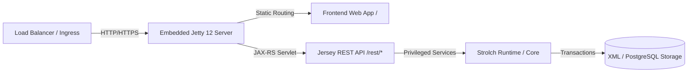

# Chronivaro Operations and Production Guide

This guide describes operational requirements, deployment procedures, system health monitoring, logging, performance expectations, data privacy, and disaster recovery for Chronivaro.

---

## 1. Production Architecture

Chronivaro is packaged as an executable standalone application (`chronivaro.jar`) combining the Strolch in-memory transaction runtime and embedded Eclipse Jetty 12 (EE10) HTTP servlet container.



- **Unified Port Architecture**: Both static frontend web assets (`/`, `/index.html`, `/assets/*`, `/js/*`) and JAX-RS REST endpoints (`/rest/chronivaro/v1/*`) are served on a single HTTP connector port.
- **Strict Layering**: `chronivaro-core` and `chronivaro-rest` maintain zero dependencies on Jetty or servlet container internals.

---

## 2. Deployment Procedures

### 2.1 Standalone Systemd Service Unit

Deploy Chronivaro on Linux using a standard systemd service unit (`/etc/systemd/system/chronivaro.service`):

```ini
[Unit]
Description=Chronivaro Time and Absence Tracking Service
After=network.target

[Service]
Type=simple
User=chronivaro
Group=chronivaro
WorkingDirectory=/opt/chronivaro
ExecStart=/usr/bin/java -Xms512m -Xmx2048m -jar /opt/chronivaro/chronivaro.jar --port 8080 --runtime /opt/chronivaro/runtime --env prod
Restart=always
RestartSec=10
SuccessExitStatus=143
TimeoutStopSec=15

[Install]
WantedBy=multi-user.target
```

Commands:
```bash
sudo systemctl daemon-reload
sudo systemctl enable chronivaro
sudo systemctl start chronivaro
sudo systemctl status chronivaro
```

### 2.2 Docker Container Distribution & Deployment

Chronivaro is distributed as a lightweight, non-root Docker container image (`repo.strolch.li/docker/chronivaro:latest`) packaging the standalone application with Eclipse Temurin OpenJDK JRE 25.

#### 2.2.1 Building and Pushing the Docker Image (Maintainers)

To build and tag the Docker image locally:

```bash
# Build the project JAR first
mvn clean package -DskipTests

# Build the local docker image
./build-docker-image.sh
```

To build and push the image to the remote registry (`repo.strolch.li`):

```bash
./build-and-push-docker.sh
```

Or manually using custom options:

```bash
./build-docker-image.sh -p -c -r repo.strolch.li
```

- `-p`: Push to Docker image registry
- `-c`: Clean up local tags after successful push
- `-r <registry>`: Target registry host (default: `repo.strolch.li`)

#### 2.2.2 Pulling the Docker Image

Users and operators can pull the prebuilt image from the registry:

```bash
docker pull repo.strolch.li/docker/chronivaro:latest
```

#### 2.2.3 Preparing the Strolch Runtime Directory

Chronivaro requires an external Strolch runtime directory containing configuration and data. Prepare the host directory structure before launching the container:

1. **Create the directory tree**:
   ```bash
   mkdir -p chronivaro/runtime/{config,data,temp}
   cd chronivaro
   ```

2. **Copy initial configuration and model data**:
   Copy the contents from the `runtime` directory of the release / repository into the newly created `runtime/` folder:
   - `runtime/config/`: `StrolchConfiguration.xml`, `PrivilegeConfig.xml`, `PrivilegeRoles.xml`, `PrivilegeUsers.xml`
   - `runtime/data/`: `templates.xml`, `Model.xml`

3. **Configure Authentication Secrets**:
   Generate secure random keys for `secretKey` and `secretSalt` in `runtime/config/PrivilegeConfig.xml`:
   ```xml
   <Parameter name="secretKey" value="<GENERATE_RANDOM_SECRET_KEY>"/>
   <Parameter name="secretSalt" value="<GENERATE_RANDOM_SECRET_SALT>"/>
   ```

4. **Verify File Permissions**:
   Ensure the directory is readable and writable by the container user (`UID 1000` / `GID 1000` by default):
   ```bash
   chmod -R 775 runtime/
   ```

#### 2.2.4 Starting Chronivaro with Docker Compose

Place the `docker-compose.yml` file in your `chronivaro` directory:

```yaml
services:
  app:
    image: repo.strolch.li/docker/chronivaro:latest
    container_name: chronivaro
    hostname: app
    ports:
      - 127.0.0.1:8080:8080
    user: "${UID:-1000}:${GID:-1000}"
    environment:
      - TZ=Europe/Zurich
      - STROLCH_ENVIRONMENT=dev
      - PORT=8080
    volumes:
      - ./runtime:/chronivaro-runtime
    restart: unless-stopped
```

Start the application daemon:

```bash
docker compose up -d
```

Follow the startup logs:

```bash
docker compose logs -f
```

The application will be available at `http://localhost:8080` (or the configured host port).

To stop the container:

```bash
docker compose down
```

To update to a newer image version:

```bash
docker compose pull
docker compose up -d
```

#### 2.2.5 Local Development with Docker Compose

For developers building the image from local source:

```bash
# Build the application JAR
mvn clean package -DskipTests

# Start the local development container
docker compose -f docker-compose-dev.yml up --build
```

---

## 3. Health Checks & Monitoring

Chronivaro exposes standard unauthenticated system probes:

### 3.1 Liveness Probe (`GET /rest/chronivaro/v1/system/health`)

Verifies that the HTTP server and Strolch agent are active:

```json
{
  "status": "UP",
  "agentState": "RUNNING",
  "uptimeMs": 3600120,
  "timestamp": "2026-08-19T13:30:00.000+02:00"
}
```

### 3.2 Readiness Probe (`GET /rest/chronivaro/v1/system/readiness`)

Verifies that domain realms are loaded and ready to serve user requests:

```json
{
  "status": "READY",
  "agentState": "RUNNING",
  "activeRealms": ["strolch"],
  "timestamp": "2026-08-19T13:30:00.000+02:00"
}
```
*HTTP Status 200 is returned when ready; 503 SERVICE_UNAVAILABLE is returned when starting up or shutting down.*

### 3.3 System Metrics (`GET /rest/chronivaro/v1/system/metrics`)

Returns runtime memory, thread pool, and CPU telemetry:

```json
{
  "heapUsedBytes": 134217728,
  "heapMaxBytes": 2147483648,
  "heapFreeBytes": 402653184,
  "nonHeapUsedBytes": 67108864,
  "activeThreads": 28,
  "peakThreadCount": 35,
  "totalStartedThreadCount": 94,
  "availableProcessors": 8,
  "systemLoadAverage": 1.25,
  "uptimeMs": 3600120,
  "timestamp": "2026-08-19T13:30:00.000+02:00"
}
```

---

## 4. Structured Logging & Distributed Tracing

Chronivaro attaches a correlation ID to every request through `CorrelationIdFilter` and Logback MDC:

- **MDC Key**: `correlationId`
- **HTTP Header**: `X-Correlation-Id`
- **Pattern**: `%d{yyyy-MM-dd HH:mm:ss.SSS} [%thread] [corrId=%X{correlationId:-NONE}] %-5level %logger{36} - %msg%n`

### Error Response Format

All REST error responses return standardized JSON error objects:

```json
{
  "error": "BAD_REQUEST",
  "message": "Start time cannot be after end time",
  "details": [
    {
      "field": "endTime",
      "code": "INVALID_CHRONOLOGY"
    }
  ]
}
```

---

## 5. Performance Benchmarks & SLAs

Chronivaro is engineered for low latency:

| Operation | Target Response Time (SLA) | Tested Performance |
|---|---|---|
| Daily Summary Calculation | `< 500 ms` | `~15 ms` |
| Monthly Employee Summary | `< 2000 ms` | `~45 ms` |
| Team Monthly Report (100 Employees) | `< 5000 ms` | `~120 ms` |
| Presence Status Overview | `< 500 ms` | `~10 ms` |
| RFC 4180 CSV Stream Export | `< 2000 ms` | `~35 ms` |

Server-side pagination (`offset` and `limit`) prevents unbounded memory allocations on large query volumes.

---

## 6. Data Privacy, Retention & Compliance

### 6.1 Role-Based Access Scoping

- **Medical & Sickness Privacy**: Sickness absence reasons and doctor's certificates are masked from team peers and visible exclusively to HR and direct supervisors.
- **Presence Abstract Status**: Unprivileged users querying `/presence` see binary working/absent states rather than sensitive absence categories.

### 6.2 Period Freezing & Tamper Prevention

- Once a monthly period is approved and locked by HR/Administrator (`STATE_LOCKED`), work entries and absences falling into that month cannot be added, edited, or deleted without formal supervisor reopening with mandatory audit justification.

### 6.3 Audit Log Immutability

- Every lifecycle change (timer start/stop, work entry edit, absence approval/rejection, period submission, config update) produces an append-only audit trail accessible under `/rest/chronivaro/v1/admin/audit-logs`.

---

## 7. Backup & Disaster Recovery

1. **Strolch Runtime State**:
   - For file-based persistence: Regularly back up the `runtime/data/` directory.
   - For PostgreSQL persistence: Execute scheduled `pg_dump` of the configured Strolch schema.
2. **Configuration Files**:
   - Maintain version control for `runtime/config/StrolchConfiguration.xml`, `PrivilegeRoles.xml`, `PrivilegeUsers.xml`, and `Templates.xml`.
3. **Session State**:
   - Session tokens are maintained in-memory and persisted across graceful restarts in `runtime/temp/sessions.dat`.
