# Chronivaro UI & Screenshots Gallery

Chronivaro features a clean, responsive single-page web interface built with modern Web Components. The UI is designed for intuitive daily time recording, effortless absence planning, efficient supervisor approval workflows, and comprehensive tenant administration.

---

## Table of Contents

- [1. Authentication & Personal Dashboard](#1-authentication--personal-dashboard)
- [2. Daily Time Tracking & Team Presence](#2-daily-time-tracking--team-presence)
- [3. Absence Management & Monthly Period Closing](#3-absence-management--monthly-period-closing)
- [4. Supervisor Approvals & Time Inspection](#4-supervisor-approvals--time-inspection)
- [5. Reporting & Analytics](#5-reporting--analytics)
- [6. Organization & Master Data Administration](#6-organization--master-data-administration)
- [7. System Configuration & Compliance](#7-system-configuration--compliance)

---

## 1. Authentication & Personal Dashboard

### Login & Secure Authentication
The login screen provides secure token-based authentication with session management, role-based redirection, and self-service password workflows.

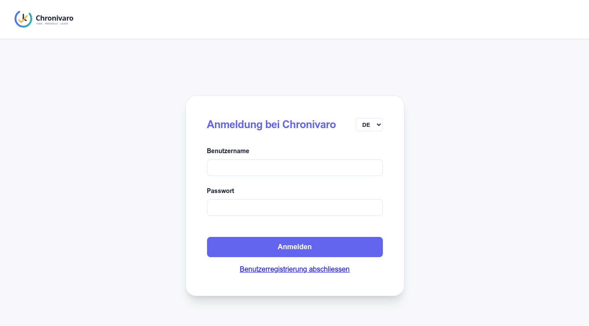

### Personal Dashboard & Live Timer
The employee dashboard provides immediate access to real-time timer controls, weekly progress tracking, active balances (overtime/undertime, remaining vacation days), and quick actions.

---

## 2. Daily Time Tracking & Team Presence

### Live Team Presence ("Who is Working?")
An interactive live presence overview showing current active colleagues, checked-in status, locations, and real-time team availability while respecting privacy constraints.

### My Times & Multi-Block Daily Time Recording
Comprehensive calendar and list views for logging work entries across multiple intervals per day. Automatically calculates gaps as breaks and handles cross-midnight overnight shifts.

---

## 3. Absence Management & Monthly Period Closing

### Absence Requests & Vacation Account Journal
Self-service absence request management for vacations, illness, military service, and special leave. Displays quota balances, accruals, and complete vacation journal history.

### Monthly Period Closing & Balance Snapshot
End-of-month employee closing workflow. Generates a verifiable calculation snapshot of target vs. actual hours, overtime balances, and vacation progression before submission to supervisors.

---

## 4. Supervisor Approvals & Time Inspection

### Employee Time Review & Inspector
Supervisors and HR managers can inspect detailed daily logs, break calculations, and work schedules for team members to ensure compliance and completeness.

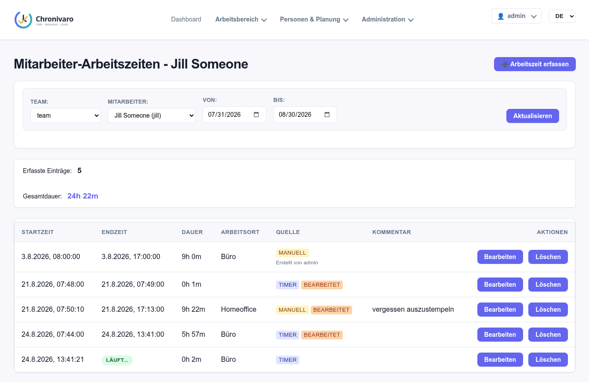

### Approvals Inbox (Absences & Monthly Periods)
A centralized approval queue for team supervisors and HR. Supports filtering by team/request type, bulk actions, optimistic concurrency checks, and mandatory feedback on rejections.

---

## 5. Reporting & Analytics

### Employee Personal Reports & CSV Export
Personal report generation allowing employees to view and download daily summaries, monthly balance histories, and RFC 4180 UTF-8 BOM CSV exports optimized for Microsoft Excel.

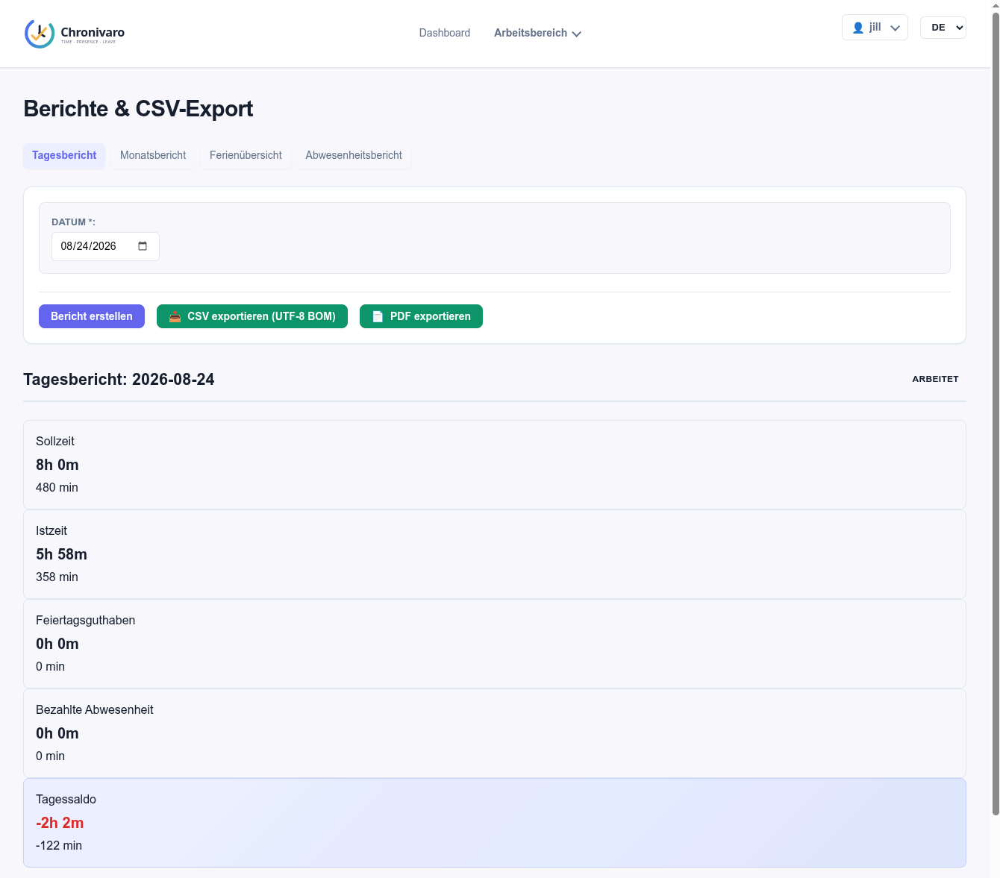

### Vacation Entitlements & Journal Report
Organization-wide overview of vacation allowances, taken days, planned leaves, and remaining vacation balances across all employees.

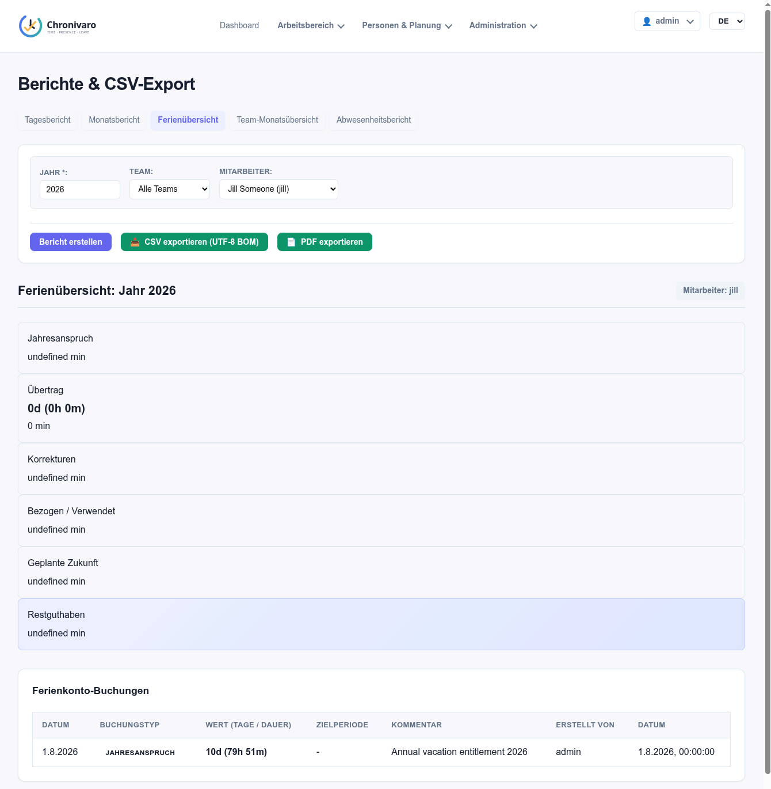

### Team Time & Performance Report
Detailed aggregation of worked hours, target differentials, and overtime trends grouped by team and department.

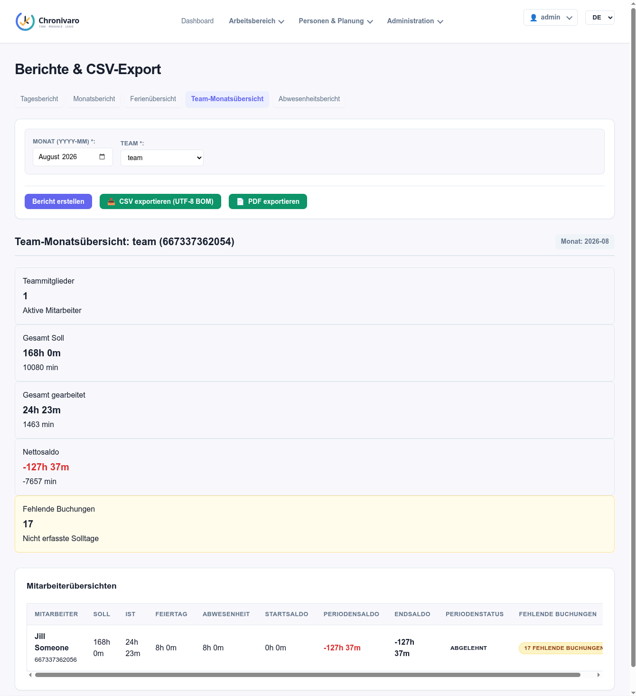

### Organization Absence Report
Comprehensive cross-department absence analytics with type filtering (vacation, sickness, military, unpaid) and date range selections.

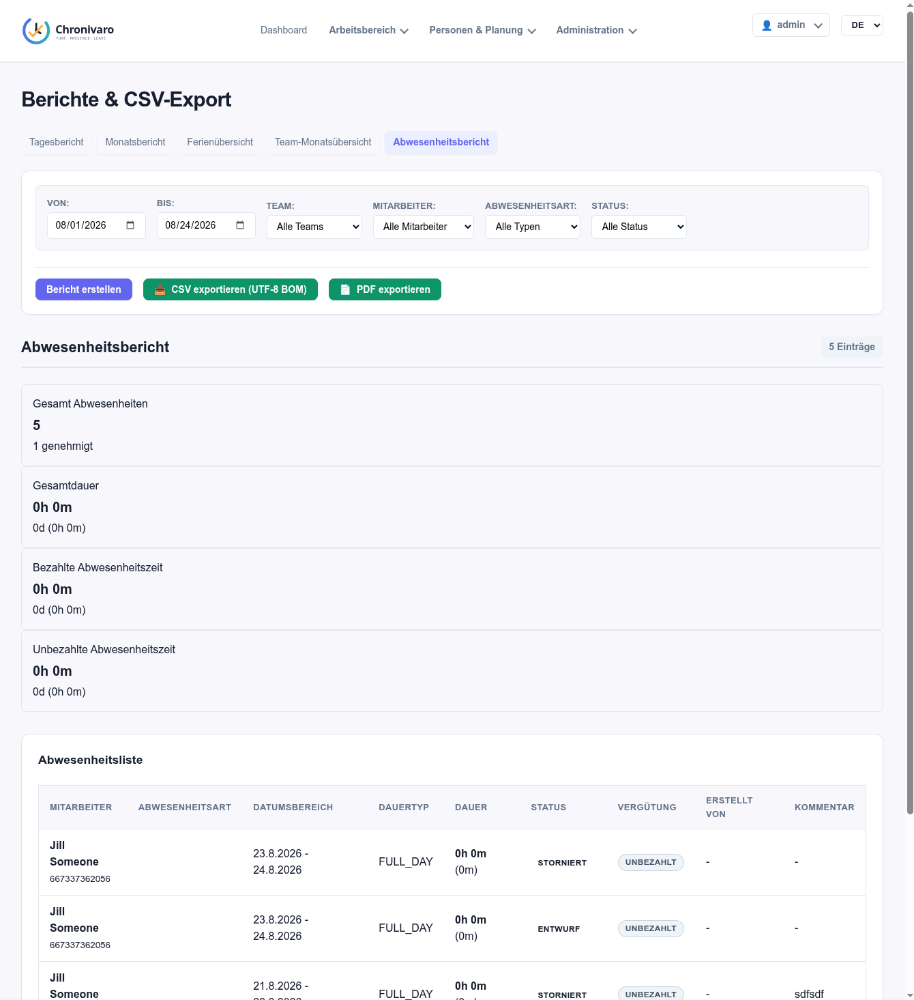

---

## 6. Organization & Master Data Administration

### Employee Directory & Profile Lifecycle
Complete employee master data management: personal details, team memberships, work locations, employment schedule assignments, and user account provisioning.

### Team & Department Structure
Organizational structure management including hierarchical teams, assigned team supervisors, and department groupings.

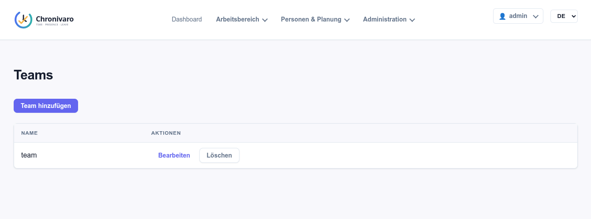

### Work Locations & Sites
Multi-site support for managing physical office locations, remote work definitions, and site-specific regional settings.

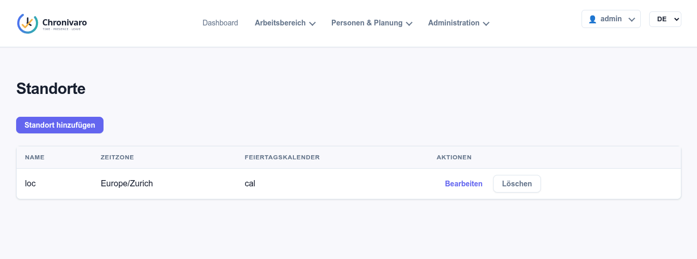

### Work Schedule Templates
Flexible schedule templates configuring weekly target hours, work day percentages (pensum), core hours, and standard break rules.

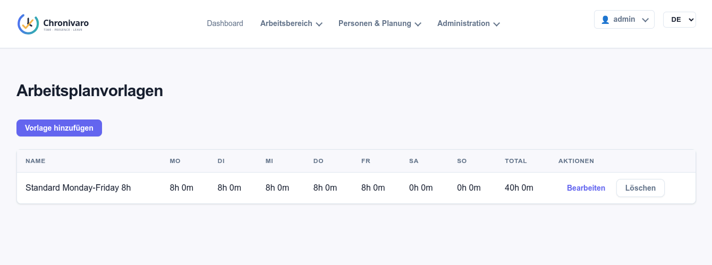

### User Accounts & Security Management
User credential management, security role assignments, account locking, and registration challenge workflows.

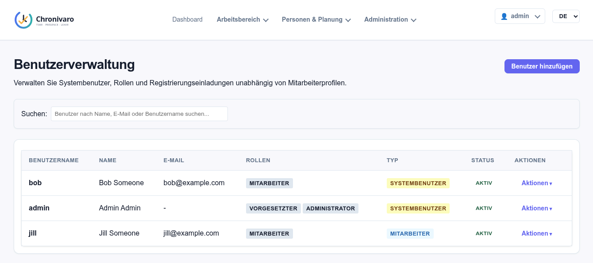

---

## 7. System Configuration & Compliance

### Absence Type Definitions
Configuration of organization-specific absence categories, duration units (Full-Day, Half-Day, Hours), vacation quota deductions, and approval requirements.

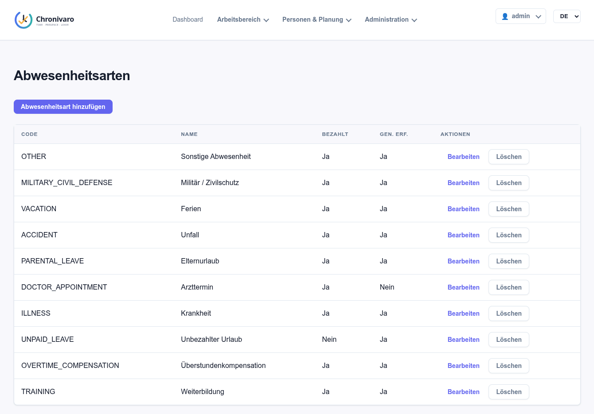

### Public Holiday Calendars
Regional holiday calendar management with support for full-day, half-day, and recurring annual holidays impacting target working hours.

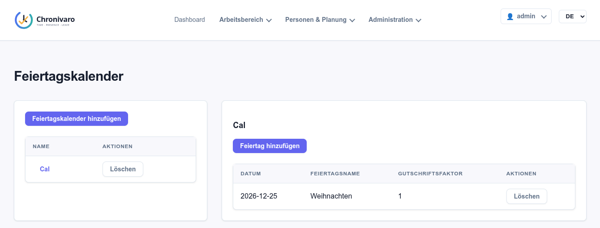

### Immutable Audit Trail & Log Inspection
Detailed append-only audit trail logging every state transition, timer action, approval, rejection, and administrative configuration modification for full compliance.

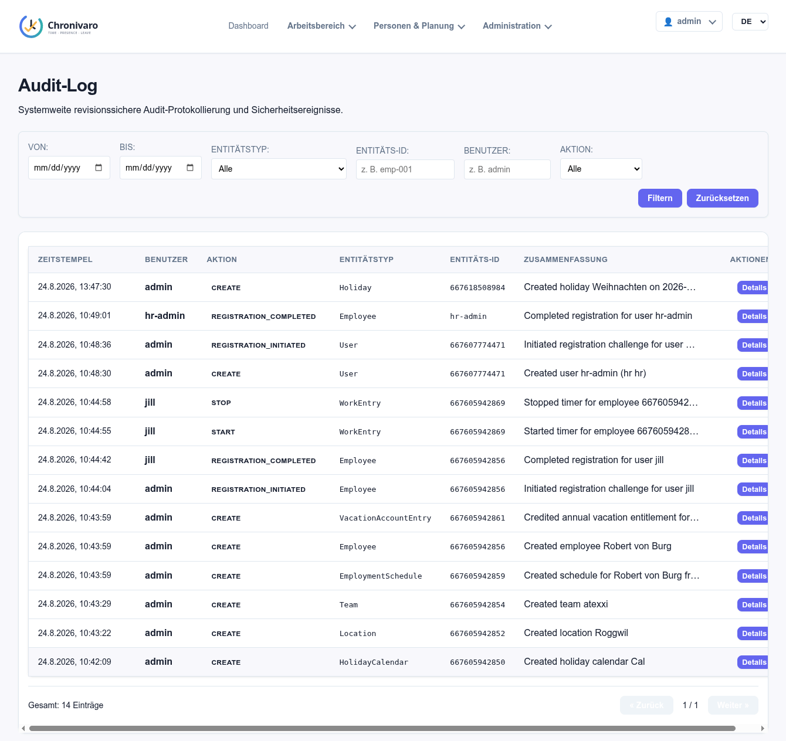

### Global Tenant Configuration
Tenant-wide parameters including timezone definitions, default schedules, period locking thresholds, and system preferences.

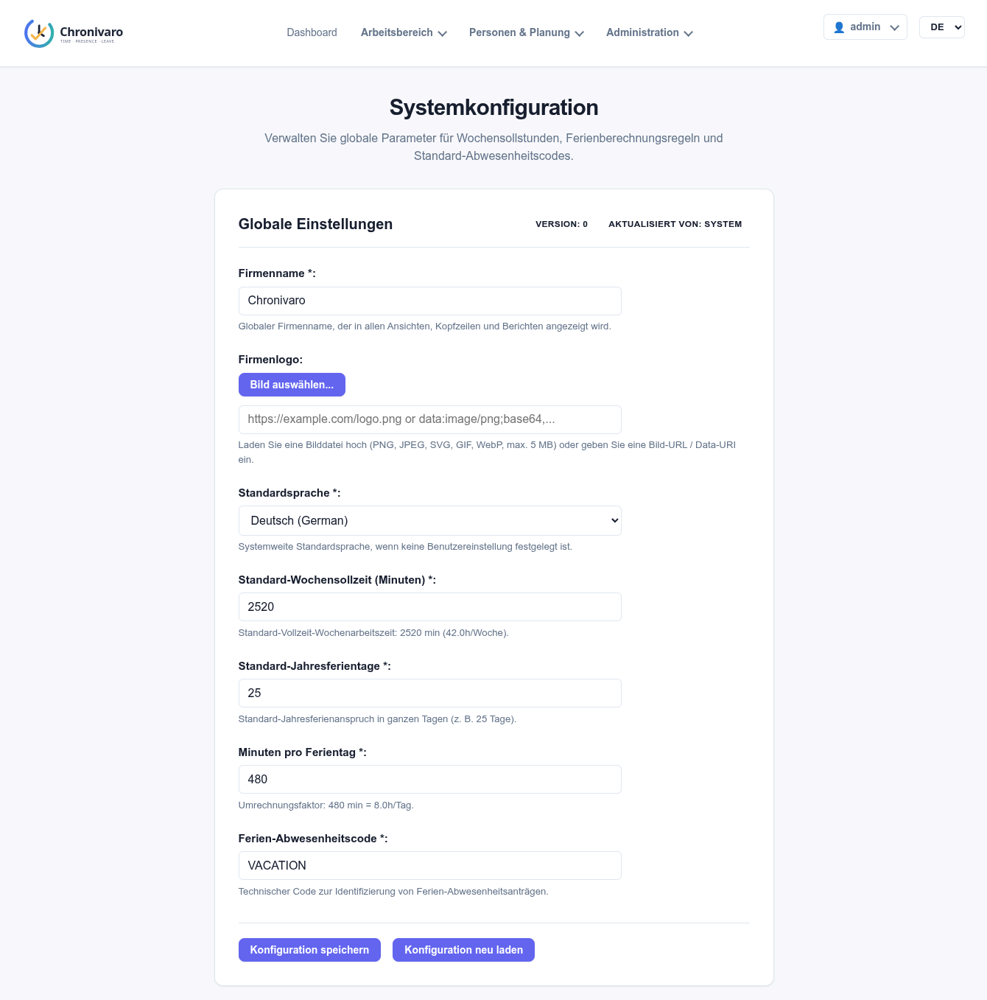
